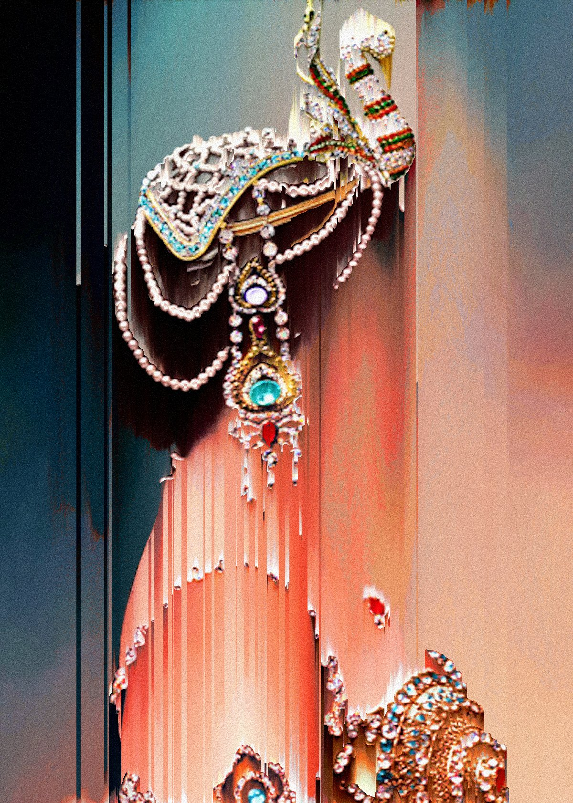
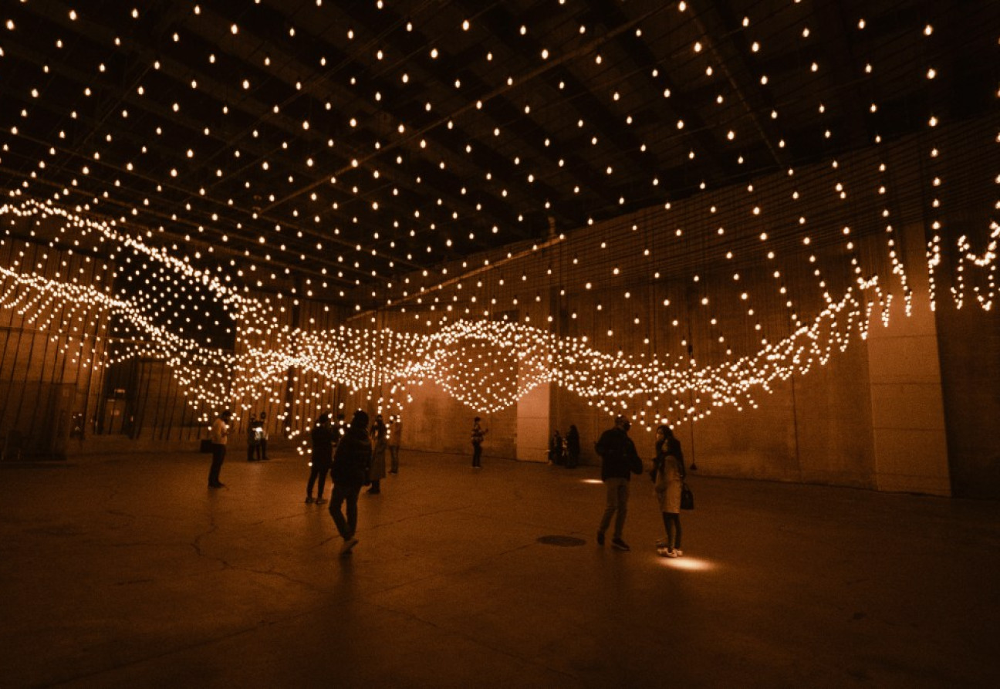

## Actividad 2
### Lulu xXX

En 2015, Lulu xXX comenzó a experimentar con inteligencia artificial basada en redes neuronales.
En su trabajo, le encanta manipular imágenes estáticas animándolas mediante secuencias de movimiento capturadas con herramientas de análisis de flujo óptico.

https://avant-galerie.com/en/artists/luluxxx
### Rafael Lozano-Hemmer
Este artista mexicano se enfoca en obras interactivas a gran escala que combinan arte generativo con participación del público. Sus piezas suelen usar datos en vivo, como latidos del corazón o posiciones de las personas en un espacio.

https://fahrenheitmagazine.com/arte/plasticas/pulse-topology-la-instalacion-de-lozano-hemmer-que-reacciona
### Sofía Crespo 
Es una artista y creadora que trabaja en la intersección del arte, la biología y la inteligencia artificial. Es conocida por su enfoque innovador
en el uso de tecnologías generativas, como redes neuronales, para explorar temas relacionados con la naturaleza, los ecosistemas y las formas de vida. 
Su trabajo busca no solo imitar los patrones naturales, sino también reimaginar la biodiversidad a través de la lente de las herramientas digitales.

https://www.ted.com/talks/sofia_crespo_ai_generated_creatures_that_stretch_the_boundaries_of_imagination
